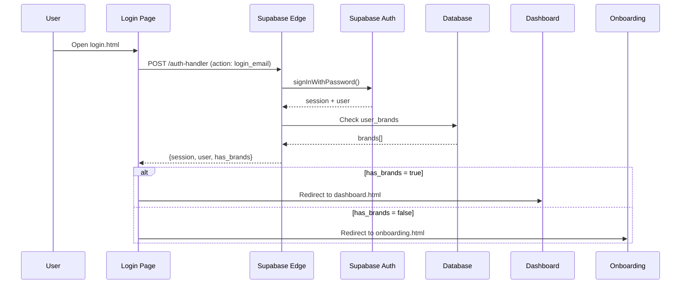

# LAPORAN AUDIT LENGKAP GEOVERA STAGING
**Tanggal**: 13 Februari 2026
**Project**: GeoVera Staging
**Supabase URL**: https://vozjwptzutolvkvfpknk.supabase.co

---

## 📋 EXECUTIVE SUMMARY

Audit menyeluruh telah dilakukan terhadap seluruh sistem GeoVera Staging, mencakup:
- ✅ Frontend (HTML/JS)
- ✅ Edge Functions (TypeScript/Deno)
- ✅ Database Schema (PostgreSQL)
- ✅ Row Level Security (RLS) Policies
- ✅ Security Advisors

---

## 🏗️ STRUKTUR PROJECT

### Root Folders
```
geovera-staging/
├── Aman-1/          # AI Orchestrators & Analytics
├── Aman-2/          # Apify, Auth, Attribution
├── Aman-3/          # Brand Chat, Citation, Claude
├── Aman-4/          # Content Generation, GeoTimeline
├── Aman-5/          # Job Orchestrator, Learning, LLM Dashboard
├── Aman-6/          # Task Management, Workflow
├── Aman-7-Pipeline/ # AI Chat Workflow, Radar Discovery
├── Aman-8-Pipeline-Clean/ # Phase 6.1 Pipeline
├── Aman-9-Phase3-Pipeline/ # Perplexity, Normalization
├── Aman-10-Onboarding-System/ # Auth, Onboarding, Payment
├── frontend/        # HTML Pages (Login, Dashboard, Onboarding)
├── supabase/        # Edge Functions
└── untitled folder/ # Duplicate files (perlu cleanup)
```

---

## 🌐 FRONTEND FILES

### Login & Auth
| File | Status | Fungsi |
|------|--------|--------|
| `login.html` | ✅ Active | Main login page dengan email/password + signup |
| `login-new.html` | ⚠️ Backup | Versi baru (belum dipakai) |
| `login-old-backup.html` | 📦 Archive | Backup lama |
| `test-auth.html` | 🧪 Test | Testing authentication flow |
| `test-simple.html` | 🧪 Test | Simple auth test |

### Onboarding
| File | Status | Fungsi |
|------|--------|--------|
| `onboarding.html` | ✅ Active | Main onboarding wizard (2-step) |
| `onboarding-old.html` | 📦 Archive | Old version |
| `onboarding-old-broken.html` | ❌ Broken | Broken version (delete) |
| `test-onboarding-debug.html` | 🧪 Test | Debugging tool |

### Dashboard
| File | Status | Fungsi |
|------|--------|--------|
| `dashboard.html` | ✅ Active | Main dashboard after login |
| `pricing.html` | ✅ Active | Pricing page (Xendit integration) |

### Configuration
```javascript
SUPABASE_URL: https://vozjwptzutolvkvfpknk.supabase.co
ANON_KEY: eyJhbGciOiJIUzI1NiIsInR5cCI6IkpXVCJ9... (valid)
```

---

## ⚙️ EDGE FUNCTIONS (Deployed di Supabase)

### Authentication System
**File**: `Aman-10-Onboarding-System/auth-handler.ts`

**Endpoints**:
- ✅ `POST /auth-handler` - Action: `signup_email`
- ✅ `POST /auth-handler` - Action: `login_email`
- ✅ `POST /auth-handler` - Action: `google_auth`
- ✅ `POST /auth-handler` - Action: `get_google_auth_url`
- ✅ `POST /auth-handler` - Action: `logout`
- ✅ `POST /auth-handler` - Action: `resend_verification`
- ✅ `POST /auth-handler` - Action: `request_password_reset`
- ✅ `POST /auth-handler` - Action: `update_password`

**Features**:
- Email/Password Signup & Login
- Google OAuth Integration
- Email Verification System
- Password Reset
- Creates `customers` record automatically
- Checks for existing brands (`has_brands`)
- Returns session tokens (access_token, refresh_token)

---

### Onboarding System
**File**: `Aman-10-Onboarding-System/onboard-brand.ts`

**Endpoints**:
- ✅ `POST /onboard-brand` - Step 1 (Required fields)
- ✅ `POST /onboard-brand` - Step 2 (Optional fields)

**Step 1 Validation** (Wajib):
- ✅ email
- ✅ brand_name (min 2 chars)
- ✅ category (18 valid categories)
- ✅ business_type (offline/online/hybrid)
- ✅ country (ISO 3166-1 alpha-2, 100+ countries)
- ✅ google_maps_url (wajib jika offline/hybrid)

**Step 2 Validation** (Optional):
- web_url
- whatsapp
- instagram_url
- tiktok_url
- youtube_url
- description

**Database RPC Called**: `onboard_brand()`

---

### Simple Onboarding (Alternative)
**File**: `supabase/functions/simple-onboarding/index.ts`

**Features**:
- Single-step onboarding
- Requires JWT authentication
- Creates brand + links to user
- Enforces 1 brand per user limit
- Default tier: `essential` ($399/mo)

---

### Payment Integration
**File**: `Aman-10-Onboarding-System/xendit-payment-handler.ts`

**Features**:
- Xendit payment gateway integration
- Invoice creation
- Webhook handling
- Payment verification

---

## 🗄️ DATABASE SCHEMA

### Total Migrations: **211 migrations**
**Latest Migration**: `20260212162622_enable_production_rls_security`

### Core Tables

#### Authentication & Users
- ✅ `customers` - Customer profiles
- ✅ `user_brands` - User-Brand mapping (many-to-many)
- ✅ `gv_brands` - Brand information
- ✅ `gv_onboarding_progress` - Onboarding wizard tracking

#### Content & Creator Management
- ✅ `gv_creator_registry` - Creator database
- ✅ `gv_creator_snapshots` - Historical creator data
- ✅ `gv_social_creators_cache` - Cached social data
- ✅ `gv_discovered_creators` - Discovery results
- ✅ `gv_creator_discovery` - Discovery tracking
- ✅ `gv_gemini_creator_crawls` - AI-powered crawls
- ✅ `gv_tiktok_posts` - TikTok content

#### Research & Intelligence
- ✅ `gv_perplexity_requests` - Perplexity AI requests
- ✅ `gv_deep_research_sessions` - Deep research tracking
- ✅ `gv_platform_research` - Platform analysis
- ✅ `gv_research_artifacts` - Research outputs
- ✅ `gv_content_opportunities` - Content suggestions
- ✅ `gv_customer_timeline` - Customer journey tracking

#### Analytics & Tracking
- ✅ `gv_engagement_tracking` - User engagement metrics
- ✅ `gv_crawl_sessions` - Crawler session tracking
- ✅ `gv_apify_usage` - Apify API usage tracking
- ✅ `gv_apify_collection_schedule` - Scheduled collections

#### Radar & Market Intelligence
- ✅ `gv_trending_hashtags` - Trend tracking
- ✅ `gv_trend_history` - Historical trends
- ✅ `gv_market_benchmarks` - Market data
- ✅ `gv_behavior_analysis` - Behavioral patterns
- ✅ `gv_creator_market_intel` - Market intelligence

#### Subscriptions & Payments
- ✅ `invoices` - Payment invoices
- ✅ `subscriptions` - Subscription management

---

## 🔐 SECURITY AUDIT FINDINGS

### ⚠️ CRITICAL ISSUES

#### 1. RLS Disabled (15 Tables)
**Risk**: High - Data dapat diakses tanpa authorization

**Affected Tables**:
```sql
gv_truth_validation
gv_trending_hashtags
gv_tiktok_posts
gv_apify_usage
gv_brands ⚠️ CRITICAL
gv_cron_jobs
gv_upload_queue
gv_nlp_analysis
gv_content_originality
gv_chat_widget_config
gv_sentiment_trends
gv_authority_network
gv_social_content_analysis
gv_social_creators_cache
gv_trend_history
```

**Recommendation**: Enable RLS immediately
```sql
ALTER TABLE gv_brands ENABLE ROW LEVEL SECURITY;
-- Repeat for all tables above
```

---

#### 2. RLS Enabled But No Policies (17 Tables)
**Risk**: Medium - RLS enabled tapi tidak efektif

**Affected Tables**:
```sql
gv_authority_citations
gv_behavior_analysis
gv_chat_sessions
gv_content_opportunities
gv_content_patterns
gv_crawl_sessions
gv_creator_discovery
gv_creator_market_intel
gv_customer_timeline
gv_deep_research_sessions
gv_discovered_creators
gv_gemini_creator_crawls
gv_market_benchmarks
gv_perplexity_requests
gv_platform_research
gv_research_artifacts
gv_reverse_engineering
```

**Recommendation**: Create brand-scoped RLS policies
```sql
-- Example:
CREATE POLICY "Users can view own brand data"
ON gv_creator_discovery
FOR SELECT
USING (
  brand_id IN (
    SELECT brand_id FROM user_brands
    WHERE user_id = auth.uid()
  )
);
```

---

#### 3. Overly Permissive RLS Policies (6 Policies)
**Risk**: Medium-High - Policies yang terlalu permissive

**Issues**:
1. **brands** - `Users can insert own brands` → `WITH CHECK (true)`
2. **gv_apify_collection_schedule** - `Allow all operations` → `USING (true)` + `WITH CHECK (true)`
3. **gv_creator_registry** - `Allow all operations` → `USING (true)` + `WITH CHECK (true)`
4. **gv_creator_snapshots** - `Allow all operations` → `USING (true)` + `WITH CHECK (true)`
5. **gv_engagement_tracking** - `Public engagement tracking` → `WITH CHECK (true)`
6. **gv_onboarding_progress** - `System can insert onboarding records` → `WITH CHECK (true)`

**Recommendation**: Replace with proper user/brand-scoped policies

---

#### 4. Security Definer Views (13 Views)
**Risk**: Medium - Views bypass RLS

**Affected Views**:
```sql
gv_top_influencers_summary
gv_unified_radar
gv_attribution_by_channel
gv_cross_insights
gv_recent_journeys
gv_llm_seo_rankings
gv_conversion_funnel
gv_social_creators_stale
gv_brand_chat_context
gv_unattributed_conversions
gv_current_authority
gv_citation_flow
gv_chat_analytics
gv_authority_leaderboard
gv_brand_chat_training
```

**Recommendation**: Change to `SECURITY INVOKER` or add proper RLS

---

#### 5. Function Search Path Mutable (70+ Functions)
**Risk**: Low-Medium - SQL injection vulnerability

**Examples**:
- `discover_trending_hashtags`
- `execute_content_generation`
- `discover_creators_by_category_pgnet`
- `perplexity_research_via_pgnet`
- And 60+ more...

**Recommendation**: Set search_path explicitly
```sql
ALTER FUNCTION function_name() SET search_path = public, pg_temp;
```

---

#### 6. Extensions in Public Schema
**Risk**: Low - Best practice violation

**Extensions**:
- pg_net
- vector
- http

**Recommendation**: Move to dedicated schema
```sql
CREATE SCHEMA IF NOT EXISTS extensions;
ALTER EXTENSION pg_net SET SCHEMA extensions;
```

---

#### 7. Leaked Password Protection Disabled
**Risk**: Medium - Users can use compromised passwords

**Recommendation**: Enable HaveIBeenPwned integration
- Go to Supabase Dashboard → Authentication → Password Protection
- Enable "Leaked Password Protection"

---

## 🔄 AUTHENTICATION FLOW

### Current Implementation



### Frontend Files Connection

```
login.html → POST /auth-handler (login_email)
  ├─ Success + has_brands = true → dashboard.html
  └─ Success + has_brands = false → onboarding.html

onboarding.html → POST /onboard-brand (step=1)
  └─ Success → POST /onboard-brand (step=2)
      └─ Success → dashboard.html

dashboard.html → Requires localStorage.access_token
```

---

## 📊 KONEKSI SUPABASE

### Environment Variables
**Frontend** (`frontend/.env.example`):
```bash
VITE_SUPABASE_URL=https://vozjwptzutolvkvfpknk.supabase.co
VITE_SUPABASE_ANON_KEY=eyJhbGciOiJIUzI1NiIsInR5cCI6IkpXVCJ9...
XENDIT_SECRET_KEY=your_xendit_secret_key_here
XENDIT_CALLBACK_TOKEN=your_xendit_webhook_token_here
FRONTEND_URL=https://geovera.vercel.app
```

### Hardcoded in Frontend
**Status**: ⚠️ Needs environment variable replacement

All frontend HTML files have hardcoded:
```javascript
const SUPABASE_URL = 'https://vozjwptzutolvkvfpknk.supabase.co';
const SUPABASE_ANON_KEY = 'eyJhbGciOiJIUzI1NiIsInR5cCI6IkpXVCJ9...';
```

**Recommendation**: Use Vite environment variables in production build

---

## 🎯 LOGIN PAGE STATUS

### Current File: `frontend/login.html`

**Features**:
- ✅ Email/Password Login
- ✅ Email/Password Signup
- ✅ Tab switching (Login ↔ Signup)
- ✅ Form validation
- ✅ Error/Success messages
- ✅ Auto-redirect based on `has_brands`
- ✅ Email confirmation reminder
- ✅ Loading states

**Missing Features**:
- ❌ Google OAuth button (only backend ready)
- ❌ "Forgot Password" link
- ❌ "Remember Me" option
- ❌ Password strength indicator
- ❌ Show/Hide password toggle
- ❌ Terms & Conditions checkbox

**Design**:
- Clean, minimal design
- Green theme (#16A34A)
- Responsive layout
- Good UX with tab navigation

---

## 🚀 RECOMMENDATIONS

### Priority 1: CRITICAL SECURITY
1. ✅ **Enable RLS on 15 tables** (gv_brands, etc.)
2. ✅ **Create RLS policies for 17 tables**
3. ✅ **Fix overly permissive policies**
4. ✅ **Enable leaked password protection**

### Priority 2: SECURITY HARDENING
5. ⚠️ **Fix Security Definer views** → Change to SECURITY INVOKER
6. ⚠️ **Set search_path on 70+ functions**
7. ⚠️ **Move extensions to dedicated schema**

### Priority 3: CODE CLEANUP
8. 📦 **Delete duplicate files** in `untitled folder/`
9. 📦 **Delete broken files**: `onboarding-old-broken.html`
10. 📦 **Archive old files** to `_archive/` folder

### Priority 4: FRONTEND IMPROVEMENTS
11. 🎨 **Add Google OAuth button** to login.html
12. 🎨 **Add "Forgot Password"** functionality
13. 🎨 **Add password strength indicator**
14. 🎨 **Replace hardcoded config** with env variables

### Priority 5: DOCUMENTATION
15. 📝 **Document all Edge Functions** with OpenAPI/Swagger
16. 📝 **Create API documentation** for frontend team
17. 📝 **Database schema documentation**

---

## ✅ STRENGTHS

1. ✅ **Well-structured Edge Functions** - Clean separation of concerns
2. ✅ **Comprehensive migration history** - 211 migrations tracked properly
3. ✅ **Multi-step onboarding** - Good UX with validation
4. ✅ **Payment integration** - Xendit properly integrated
5. ✅ **Authentication system** - Email + Google OAuth ready
6. ✅ **Frontend organization** - Clean file structure

---

## 📝 NEXT STEPS

### Immediate Actions (Today)
- [ ] Enable RLS on critical tables (gv_brands, etc.)
- [ ] Create basic RLS policies for brand-scoped data
- [ ] Enable leaked password protection in Supabase Dashboard

### This Week
- [ ] Fix Security Definer views
- [ ] Add Google OAuth button to login page
- [ ] Clean up duplicate files
- [ ] Test full authentication flow end-to-end

### This Month
- [ ] Set search_path on all functions
- [ ] Complete API documentation
- [ ] Add password reset functionality
- [ ] Implement proper environment variable management

---

## 📞 CONTACT & SUPPORT

**Supabase Project**: vozjwptzutolvkvfpknk
**Frontend URL**: https://geovera.vercel.app (planned)
**Database**: PostgreSQL 15+
**Edge Runtime**: Deno

---

**END OF AUDIT REPORT**
Generated: 13 February 2026
